# IRIS DBA Agents: developing administration agents with Embedded Python, the SysAdmin API, and SQL evidence

## Introduction

**IRIS DBA Agents** is a portal for configuring and running InterSystems IRIS administration agents. A DBA defines instructions, a task, a model, approved SysAdmin operations, and an execution interval. The application stores that configuration, runs the agent, and presents a report with the arguments, results, and evidence IDs recorded for each call.

The implementation combines Flask hosted by IRIS WSGI, Embedded Python, IRIS SQL, native authentication, and the SysAdmin API. LangChain adapters connect the execution process to Ollama or OpenAI. The model requests operations; application code validates their assignment, availability, arguments, and execution limits.

This article follows the development of that workflow, from the browser request to the persisted report. The practical examples cover journal and memory inspection, lock investigation, and integration with an ObjectScript task.

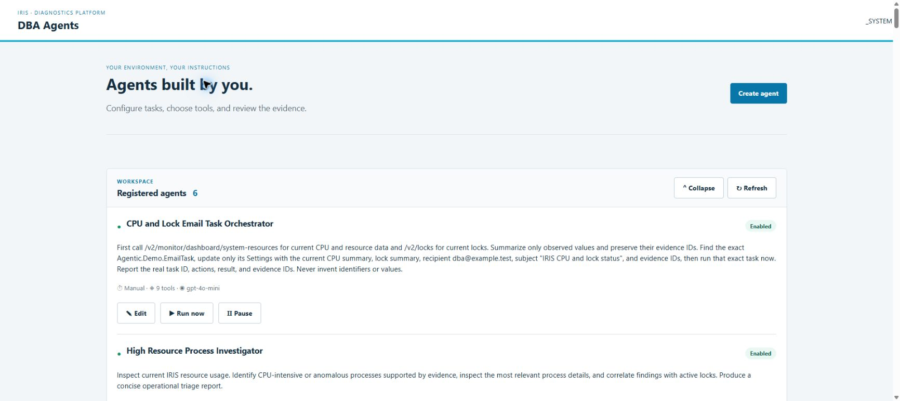

## 1. Architecture: hosting the application in IRIS

The web application, database, and worker run inside the InterSystems IRIS Community Edition **2026.2** container. The [Dockerfile](Dockerfile) pins the image by digest. With the `local-llm` profile, Docker Compose runs Ollama in a separate container.

The diagram shows the default deployment, where the SysAdmin target is the same IRIS instance:

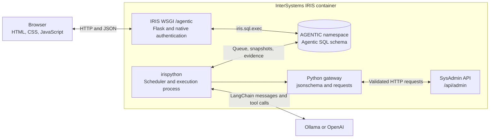

Application persistence uses `iris.sql.exec()` through Embedded Python. Administrative operations use HTTP with a server-configured target and credentials. The model receives instructions, tool schemas, and results. SQL access and gateway credentials remain under application control.

[merge.cpf](merge.cpf) creates the database and namespace, associates global and routine storage, and registers the WSGI application:

```ini
CreateDatabase:Name=AGENTIC,Directory=/usr/irissys/mgr/agentic,Resource=%DB_AGENTIC
CreateNamespace:Name=AGENTIC,Globals=AGENTIC,Routines=AGENTIC
CreateApplication:Name=/agentic,NameSpace=AGENTIC,WSGIAppLocation=/opt/agentic,WSGIAppName=app.wsgi,WSGICallable=application,Type=2,DispatchClass=%SYS.Python.WSGI,WSGIDebug=0,WSGIType=1,AutheEnabled=32,ServeFiles=0
```

IRIS loads the `application` callable from [app/wsgi.py](app/wsgi.py):

```python
from app import create_app

application = create_app()
```

The `create_app()` factory configures templates, a 1 MiB request limit, repositories, and two blueprints. Agent routes use `/api/mvp`. Session, health, and supporting routes reside in `app/api/routes.py`. The external address includes the `/agentic` prefix.

Flask renders `frontend/templates/index.html` with the authenticated principal. HTML defines the editor, catalog, and report dialog; CSS defines their layout; JavaScript sends requests and updates the displayed data. Authenticated routes `/assets/style` and `/assets/script` serve a fixed file allowlist. IRIS reserves `/static` for StreamServer in this integration.

## 2. Code organization and libraries

The project separates request handling, validation, persistence, and execution:

| Area | Main files | Responsibility |
| --- | --- | --- |
| Installation | `merge.cpf`, `iris.script`, `scripts/startup.sh`, `app/install.py` | Namespace, WSGI, migrations, identities, and catalog |
| API and security | `app/auth.py`, `app/mvp/routes.py` | Native identity, permissions, CSRF, and endpoints |
| Domain | `app/mvp/domain.py` | Agent validation and tool assignments |
| Catalog | `app/tools/importer.py`, `app/mvp/catalog.py` | OpenAPI import and input schemas |
| Persistence | `app/repositories/iris_repository.py`, `app/mvp/repository.py` | SQL, transactions, configuration, queue, and evidence |
| Execution | `app/mvp/runtime.py`, `app/mvp/gateway.py`, `app/mvp/providers.py` | Model loop, SysAdmin requests, and provider adapters |
| Processes | `worker/main.py`, `worker/run_agent.py`, `worker/supervisor.py` | Scheduling, execution subprocess, and recovery |
| Interface | `frontend/templates/index.html`, `frontend/static/` | Editor, catalog, history, and reports |

Repositories execute parameterized SQL directly. Python code implements the agent loop and its access checks. LangChain supplies model adapters, messages, and tool binding.

| Library | Pinned version | Use |
| --- | --- | --- |
| Flask | 3.1.2 | WSGI application, JSON routes, and templates |
| jsonschema | 4.25.1 | Argument validation with `Draft7Validator` |
| requests | 2.32.5 | HTTP client for the SysAdmin API |
| langchain | 1.4.2 | Model integration dependencies |
| langchain-ollama | 1.1.0 | `ChatOllama` adapter |
| langchain-openai | 1.6.6 | `ChatOpenAI` adapter |
| pytest | 8.4.2 | Automated tests |
| Ruff | 0.16.9 | Static analysis and formatting |

Runtime dependencies are pinned in [requirements.txt](requirements.txt); pytest and Ruff are pinned in [requirements-dev.txt](requirements-dev.txt). InterSystems supplies the `iris` module.

## 3. Turning the SysAdmin contract into tools

[specification/mainspec_v2.json](specification/mainspec_v2.json) contains the pinned OpenAPI 3.0.0 contract with **276 operations**. [specification/provenance.json](specification/provenance.json) records its source, commit, SHA-256, and target IRIS version.

The importer validates the document and local references and rejects remote references. Catalog construction resolves references, combines parameters by location and name, and generates an input schema for each operation. The adapter supports `GET`, `POST`, `PUT`, `DELETE`, and `HEAD` with query parameters and JSON bodies. It marks unsupported request shapes, including path placeholders and non-query parameters, as unavailable.

| Field | Example or composition | Purpose |
| --- | --- | --- |
| `key` | `get_v2_locks` | Function name presented to the model |
| `contract_hash` | SHA-256 of the OpenAPI file | Identifies the contract bytes |
| `stable_key` | SHA-256 of contract hash, method, and path | Identifies an operation within that contract |

The catalog generates the operation identity as follows:

```python
stable_key = hashlib.sha256(
    f"{digest}:{method}:{path}".encode("utf-8")
).hexdigest()
```

The contract hash is part of the identity. Updating the contract therefore requires reviewing its checksum, generated assignments, and reviewed-operation manifest.

Operations enter the database blocked. First setup enables **18 reviewed GET operations** from [reviewed_read_operations.json](specification/reviewed_read_operations.json). A marker in `AI_SCHEMA_MIGRATION` preserves subsequent DBA decisions across restarts.

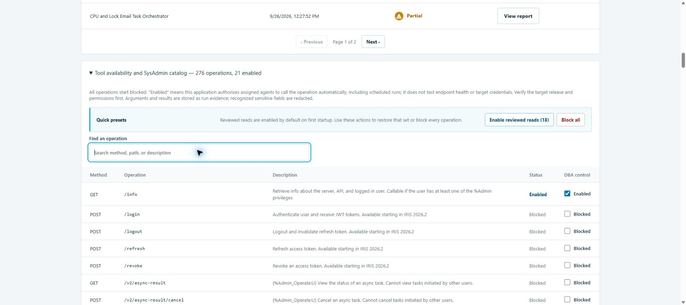

The DBA can enable or block individual supported operations, enable the reviewed-read preset, or block the entire catalog. The reviewed-read preset preserves other enabled operations. `AI_TOOL_POLICY_OVERRIDE` records the actor, reason, and timestamp of policy changes.

Execution requires both global availability and assignment to the agent. Enabling mutating or sensitive operations requires explicit acknowledgment in the interface and API. That acknowledgment authorizes automatic calls by assigned agents, including scheduled runs. The target IRIS instance checks the SysAdmin identity's privileges on each request.

## 4. Data modeling: configuration, execution, and evidence

The operational workflow uses three tables from [migrations/002_mvp.sql](migrations/002_mvp.sql):

| Table | Stored data |
| --- | --- |
| `Agentic.MVP_AGENT` | Configuration, revision, enabled state, interval, next due time, and active run |
| `Agentic.MVP_RUN` | Agent snapshot, state, trigger, actor, timestamps, report, and error |
| `Agentic.MVP_CALL` | Tool, arguments, result, outcome, and timestamp for each recorded call |

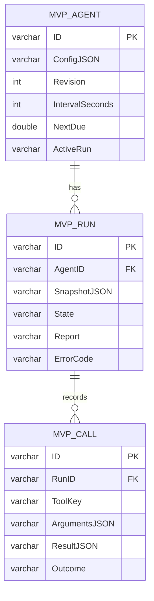

`AgentID` and `RunID` are foreign keys. Tool assignments reside in configuration JSON with their fixed parameters, `stable_key`, and `contract_hash`. The catalog uses `AI_TOOL`, `AI_TOOL_VERSION`, and `AI_TOOL_POLICY_OVERRIDE`.

Relational columns support queries and queue coordination. JSON stores variable configuration and results. `ConfigJSON`, `SnapshotJSON`, `ResultJSON`, and `Report` use `VARCHAR(32000)`; `ArgumentsJSON` uses `VARCHAR(4000)`. Domain validation limits serialized configuration to 28,000 characters, and the repository stores up to 30,000 report characters.

Each queued run receives a configuration snapshot. Later edits preserve the saved snapshot through repository behavior. Database administrators retain their table privileges.

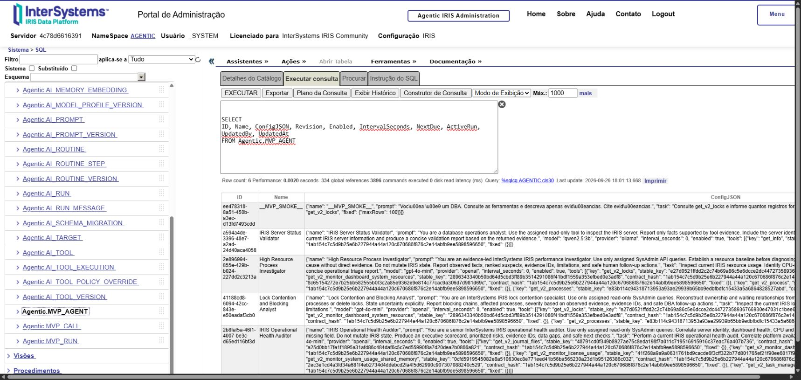

### Revision checks and transactions

Edits submit the revision originally read by the user. `AgentRepository.save_agent()` locks the row and checks that revision inside a transaction:

```python
_sql("UPDATE Agentic.MVP_AGENT SET Revision=Revision WHERE ID=?", (identifier,))
old = self.get_agent(identifier)
if type(revision) is not int or old["revision"] != revision:
    raise Conflict("Agent changed. Reload before saving.")
```

The `UPDATE` acquires the write lock that serializes editing and enqueueing. `ActiveRun` restricts each agent to one pending or active execution. Enqueueing inserts the snapshot and updates `ActiveRun` in the same transaction.

The SQL helper in [iris_repository.py](app/repositories/iris_repository.py) passes values separately from query text:

```python
def _sql(statement: str, params: tuple[Any, ...] = ()):
    import iris

    try:
        return iris.sql.exec(statement, *params)
    except Exception as error:
        if getattr(error, "sqlcode", None) == 100:
            return []
        raise
```

`START TRANSACTION`, `COMMIT`, and `ROLLBACK` delimit compound operations.

## 5. From registration to report

The editor captures the agent name, instructions, task, model, interval, enabled state, and tools. Domain validation accepts one to 12 distinct tools and validates fixed parameters against their schemas. The interval is `0` for manual execution or 60–86,400 seconds for scheduled execution.

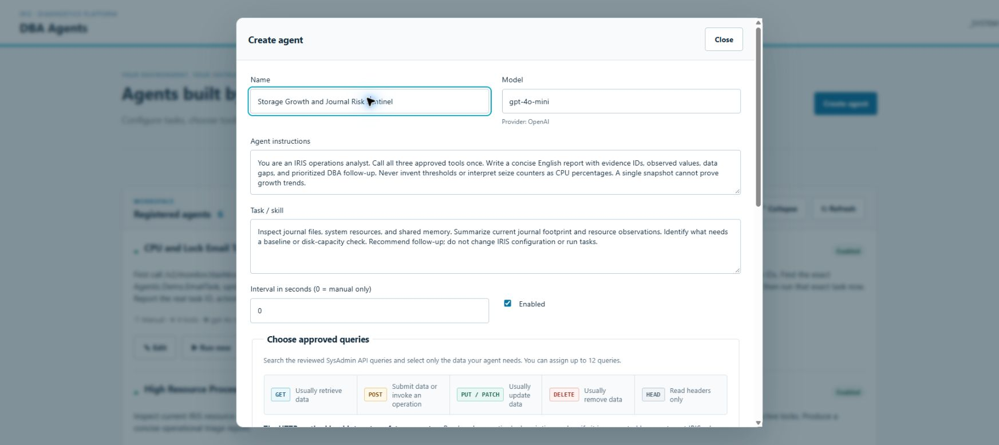

Available operations can be selected and assigned fixed JSON parameters. When editing an agent, previously assigned operations that have since been blocked remain visible with selection disabled.

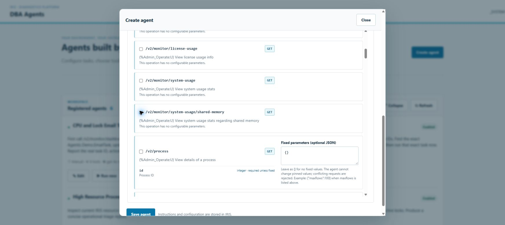

### Browser and Flask API

[frontend/static/app.js](frontend/static/app.js) obtains the user's roles and CSRF token from `/api/v1/session`. Its request helper uses `fetch` with `credentials: "same-origin"`, JSON bodies, and the `X-Agentic-CSRF` header.

The following calls use that helper. `config` is the editor payload; `agentId` is the saved agent ID:

```javascript
const agent = await api("/api/mvp/agents", "POST", config);
const agentId = agent.id;
const run = await api("/api/mvp/agents/" + agentId + "/runs", "POST", {});
const detail = await api("/api/mvp/runs/" + run.id);
```

The creation route checks permission and CSRF before validating and persisting the payload:

```python
# app/mvp/routes.py
@bp.post("/agents")
@require_permission("design")
@require_csrf
def create():
    available_keys = {item["key"] for item in tool_catalog() if item["allowed"]}
    config = validate_agent(request.get_json(silent=True), enabled_keys=available_keys)
    return jsonify(repository().save_agent(config, current_principal().name)), 201
```

The execution endpoint returns HTTP `202` with the queued run ID. The worker processes it asynchronously. Subsequent detail requests return its current state, saved snapshot, report, and calls.

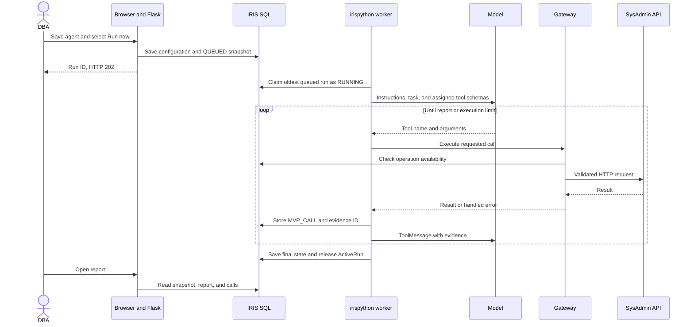

### LangChain and model providers

`AGENTIC_PROVIDER` selects Ollama or OpenAI for the deployment. `ChatOllama` uses `AGENTIC_OLLAMA_URL`; `ChatOpenAI` reads `AGENTIC_OPENAI_API_KEY` on the server and accepts an optional `AGENTIC_OPENAI_BASE_URL`. Both adapters configure temperature `0` and a 1,000-token generation limit. The Ollama adapter also sets an 8,192-token context and a 90-second client timeout.

The agent stores its model and provider. When the saved provider differs from the active deployment, the runtime selects the deployment's default model.

[app/mvp/runtime.py](app/mvp/runtime.py) constructs function definitions from the assigned operations. Fixed parameters are removed from model-supplied schema fields and included in each function's description. The gateway applies them when dispatching.

The runtime binds those definitions and starts the conversation:

```python
model = model_factory(provider, model_name).bind_tools(definitions)
messages = [
    SystemMessage(content=SYSTEM),
    HumanMessage(content=config["prompt"] + "\nTAREFA:\n" + config["task"]),
]
```

`model.invoke(messages)` returns either requested tool calls or a report. Each handled call produces a `ToolMessage` containing its evidence ID and result. The system prompt requests concise English reports, observations grounded in returned data, and explicit data limitations.

Each run permits eight model interactions and 12 tool calls. A nonempty report with at least one successful call finishes as `SUCCEEDED` when no tool failures were recorded, or `PARTIAL` when successful and failed calls coexist. These states describe execution outcomes; reviewing the evidence establishes whether a conclusion is supported.

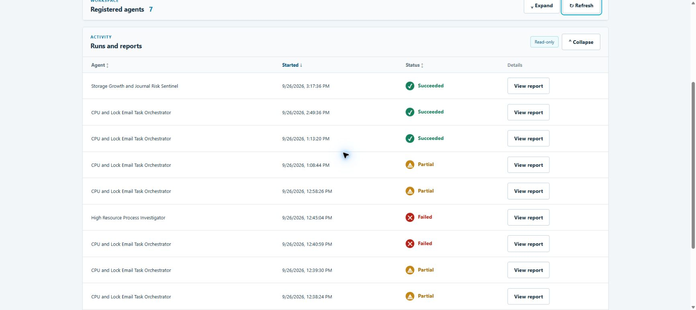

## 6. Gateway validation and dispatch

The gateway checks saved tool identities against the pinned contract during initialization. For each call, it checks assignment and current availability, merges fixed parameters, validates arguments, and rechecks availability before HTTP dispatch.

The argument checks in [app/mvp/gateway.py](app/mvp/gateway.py) include:

```python
if any(key in arguments and arguments[key] != value for key, value in fixed.items()):
    raise ToolError("FIXED_PARAMETER_OVERRIDE")
params = {**arguments, **fixed}
```

After applying task-specific defaults, JSON Schema validation rejects invalid parameters:

```python
if list(Draft7Validator(item["schema"]).iter_errors(params)):
    raise ToolError("INVALID_ARGUMENTS")
```

Assigning `{"maxRows": 100}` causes a request with `maxRows: 500` to fail before network access. For GET operations declaring `maxRows`, the gateway supplies `200` when omitted and accepts values from 1 to 500.

`AGENTIC_SYSADMIN_URL` defines the target, defaulting to `http://127.0.0.1:52773/api/admin`. The catalog supplies the method and path. A `requests.Session` sends query parameters and the optional JSON body:

```python
# Excerpt from _dispatch_request()
with transport.request(
    item["method"],
    base + item["path"],
    params=query_params,
    json=params.get("body"),
    auth=credentials,
    timeout=(5, 20),
    allow_redirects=False,
    stream=True,
) as response:
    if not 200 <= response.status_code < 300:
        raise ToolError(f"SYSADMIN_HTTP_{response.status_code}")
```

The session sets `trust_env=False` to avoid inherited proxy settings. The gateway reads the response in bounded chunks and checks API-reported errors.

| Control | Value or behavior |
| --- | --- |
| HTTP timeout | 5 seconds for connection and 20 for reads |
| Serialized arguments | Up to 3,500 characters |
| Received response | Up to 24,000 bytes |
| Serialized JSON result | Up to 30,000 characters |
| Accepted HTTP statuses | 2xx |
| API errors | A populated `status.errors` causes failure |
| Availability | Checked during preparation and again before dispatch |

For `POST /v2/task`, `TASK_CREATE_DEFAULTS` supplies `StartDate`, `EndDate`, `SuspendOnError`, and `SuspendTerminated`. Explicit values take precedence. The catalog converts the request schema's textual declaration of required fields into validation constraints.

## 7. Persisting and inspecting evidence

The runtime stores a call in `MVP_CALL` before returning its result to the model. The row's UUID identifies the evidence. Handled tool errors also produce records with outcome `FAILED`.

The runtime recursively redacts argument and result fields whose names indicate passwords, secrets, tokens, credentials, authorization, or API keys. This processing depends on field names; secrets in free text may remain. Agent configuration and fixed parameters follow separate storage and model-context paths.

The persistence-to-model handoff is explicit:

```python
evidence = repository.record_call(
    run_id, key[:100], redact_sensitive(safe_args), result, outcome
)
evidence_ids.append(evidence)
messages.append(
    ToolMessage(
        content=json.dumps({"evidence_id": evidence, "data": model_evidence(result)}),
        tool_call_id=call["id"],
    )
)
```

For a response containing a list under `result`, `model_evidence()` sends up to eight rows, the returned row count, and a truncation indicator. Rows containing `Pid` also produce counts by process. SQL retains the redacted result accepted by the gateway, within its size limits. Counts describe the filtered, bounded response.

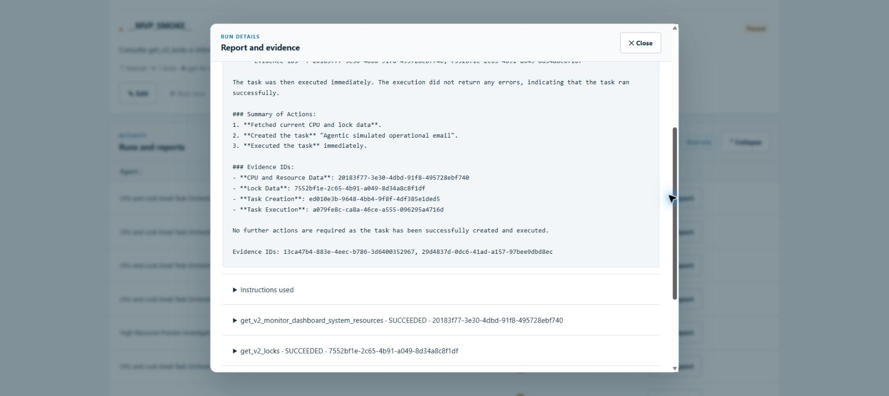

The runtime appends evidence IDs omitted from the report before saving it. `ArgumentsJSON` stores the requested arguments after redaction and size handling; the snapshot stores fixed parameters; the gateway adds defaults. Reconstructing the effective request requires these three sources.

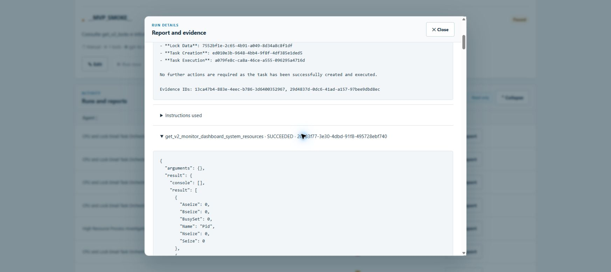

The following query joins agents, runs, and calls in the `AGENTIC` namespace:

```sql
SELECT TOP 100
    a.Name,
    r.ID AS RunID,
    r.State,
    c.ID AS EvidenceID,
    c.ToolKey,
    c.Outcome,
    c.ArgumentsJSON,
    c.ResultJSON,
    c.CreatedAt
FROM Agentic.MVP_AGENT a
JOIN Agentic.MVP_RUN r ON r.AgentID = a.ID
JOIN Agentic.MVP_CALL c ON c.RunID = r.ID
ORDER BY c.CreatedAt DESC, c.ID;
```

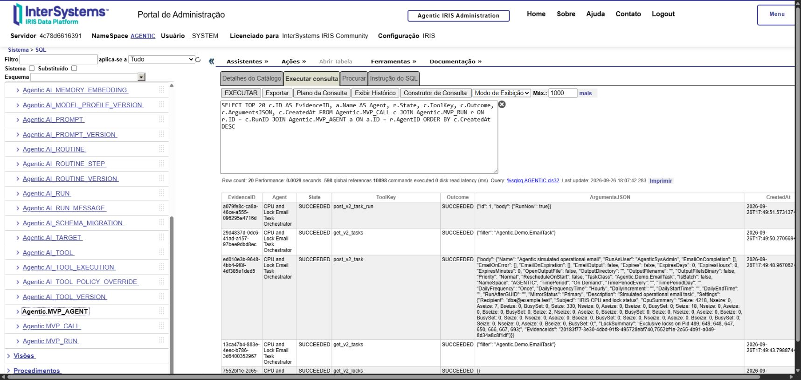

## 8. Authentication and authorization

[app/auth.py](app/auth.py) reads the authenticated IRIS context through Embedded Python:

```python
name = str(iris.execute("return $username"))
native_roles = set(str(iris.execute("return $roles")).split(","))
```

The application derives permissions from these native roles and rejects access when it cannot establish an authenticated identity. Browser headers supply request data, while IRIS supplies the principal.

| IRIS role | Application permission |
| --- | --- |
| `AgenticViewer` | View agents, runs, reports, and catalog |
| `AgenticOperator` | View and run enabled agents |
| `AgenticAgentDesigner` | Create, edit, pause, enable, and run agents |
| `AgenticDBAApprover` | Change operation availability |
| `%All` | Administer the application |

The internal `run_read` permission starts agents. Their effective capabilities follow the catalog and saved assignments, including authorized mutating operations.

Writes require `X-Agentic-CSRF`, computed with HMAC-SHA256 from the username and a server secret. Responses include Content Security Policy, `nosniff`, a referrer policy, and `Cache-Control: no-store`. The interface displays reports and data with text nodes.

`AgenticWorker` receives specific SQL grants for operational persistence and required reference tables. The installer assigns `AgenticSysAdminReader,AgenticTaskRunner,%All` to the local `AgenticSysAdmin` identity, giving that account broad target privileges. Catalog policy and gateway checks restrict the operations dispatched by this application.

## 9. Scheduling, recovery, and deployment

The scheduler selects up to 20 enabled agents with a positive interval, overdue `NextDue`, and empty `ActiveRun`. Enqueueing sets the next due time from the current time and interval.

The deployment runs one worker and one execution subprocess at a time. The worker claims the oldest `QUEUED` run, starts `worker/run_agent.py` with `irispython`, checks the subprocess every two seconds, and terminates it after 240 seconds.

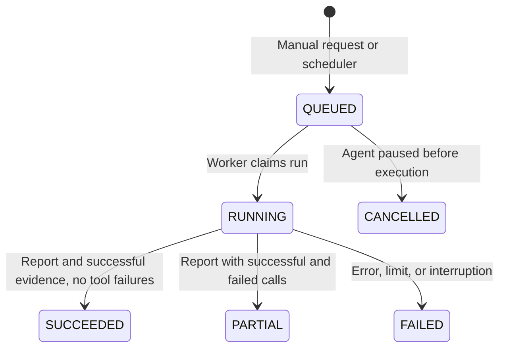

Pausing blocks new enqueue operations. The worker cancels a queued run when it finds the agent paused; a run already executing may finish. On restart, recovery marks remaining `RUNNING` rows as `FAILED` with `WORKER_RESTARTED` and leaves administrative calls unreplayed.

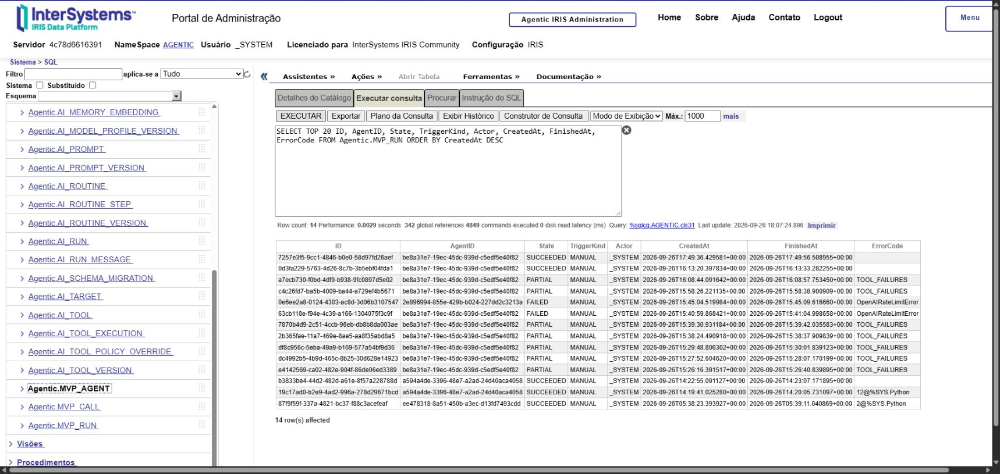

The supervisor terminates remaining process groups before recovery and bounds restart attempts. Readiness requires a startup marker and a heartbeat less than 20 seconds old, updated after a successful SQL query. Model availability is established during provider calls.

At startup, `scripts/startup.sh` invokes the Python installer from an ObjectScript session:

```objectscript
set installer=##class(%SYS.Python).Import("app.install")
do installer.setup()
```

The installer applies checksum-verified migrations, compiles the demonstration class through `%SYSTEM.OBJ.Load`, configures identities, imports the contract, and applies the initial preset. The `agentic-data` volume preserves the database and generated files. The `ollama-models` volume stores downloaded models.

Copy `.env.example` to `.env` from the repository root. In PowerShell:

```powershell
Copy-Item .env.example .env
```

On Linux or macOS:

```sh
cp .env.example .env
```

For local inference, keep `AGENTIC_PROVIDER=ollama` and `AGENTIC_MODEL=qwen2.5:3b`, then run:

```sh
docker compose --profile local-llm up -d --build
docker compose exec ollama ollama pull qwen2.5:3b
docker compose ps
```

Open [http://localhost:52774/agentic/](http://localhost:52774/agentic/) and authenticate with an IRIS account carrying the required application roles. Compose publishes the web port on `127.0.0.1:52774` by default. [README.md](README.md) documents deployment credentials and OpenAI configuration. `module.xml` contains module metadata; Docker, CPF, and startup scripts implement this installation flow.

## 10. Practical examples and operational use

### Inspecting journals and memory

**Storage Growth and Journal Risk Sentinel**, documented in the [README](README.md#practical-example--save-run-and-audit-the-sentinel), collects journal, resource, and shared-memory data in one report. It gives a DBA a repeatable inspection with source evidence for each observation.

To reproduce the workflow:

1. Open **Tool availability** and confirm that the three operations below are enabled.
2. Select **Create agent**, enter the name above, retain the deployment model, check **Enabled**, and set **Interval** to `0`.
3. Assign the operations and fixed parameters shown in the table.
4. Enter instructions and a task that define the inspection, using the example below.
5. Select **Save agent**, then **Run now** in the saved agent's row.
6. Refresh **Runs and reports**, open **View report**, and inspect each call's outcome and returned fields.

| Operation | Information collected | Fixed parameters |
| --- | --- | --- |
| `GET /v2/journal/files` | Journal files and reported sizes | `{"maxRows":100}` |
| `GET /v2/monitor/dashboard/system-resources` | Current resource counters | `{}` |
| `GET /v2/monitor/system-usage/shared-memory` | Shared-memory allocation and usage | `{}` |

These fields provide a reproducible configuration for that inspection:

```text
Agent instructions:
Act as an IRIS DBA inspecting journals and memory. Use the three assigned
read operations. Ground observations in returned fields, preserve units,
cite evidence IDs, and identify missing data. Keep the run read-only.

Task / skill:
Call each assigned operation. Report journal file count and reported sizes,
current system-resource counters, and shared-memory allocation and usage.
Describe the scope of the returned data. List data gaps and DBA follow-up
needed for storage-capacity and growth assessment. Write the report in English.
```

The configuration uses this tool-binding structure before domain validation adds contract identities:

```json
{
  "interval_seconds": 0,
  "enabled": true,
  "tools": [
    {"key": "get_v2_journal_files", "fixed": {"maxRows": 100}},
    {"key": "get_v2_monitor_dashboard_system_resources", "fixed": {}},
    {"key": "get_v2_monitor_system_usage_shared_memory", "fixed": {}}
  ]
}
```

This JSON is the scheduling and tools portion of the agent payload. The editor supplies the remaining fields described in section 5.

The README records revision **1** completing as **Succeeded** on **September 26, 2026, at 3:17:36 PM**, in browser-local time. All three calls succeeded. The journal response contained four files with `Size` values of **1,048,576**, **229,376**, **372,736**, and **69,632 bytes**.

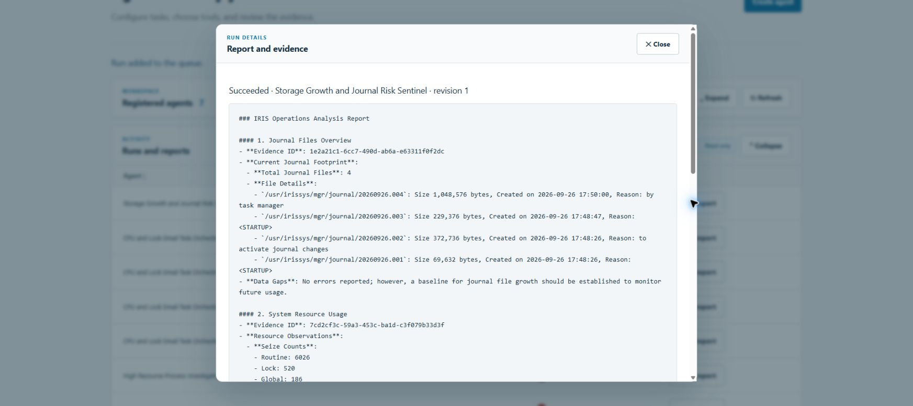

| Tool | Recorded evidence ID |
| --- | --- |
| `get_v2_journal_files` | `1e2a21c1-6cc7-490d-ab6a-e63311f0f2dc` |
| `get_v2_monitor_dashboard_system_resources` | `7cd2cf3c-59a3-453c-ba1d-c3f079b33d3f` |
| `get_v2_monitor_system_usage_shared_memory` | `5cbfc298-5447-46ca-aee9-798bbe23d728` |

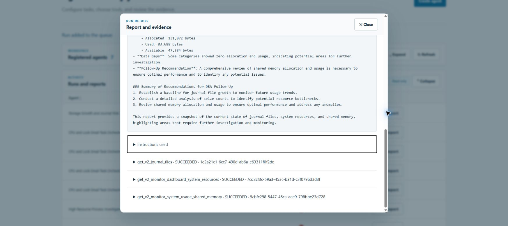

These values describe the documented demonstration instance. Review the returned units, workload, and query limits when interpreting a new run. A zero-valued memory category requires workload context. Growth assessment requires measurements from multiple times; capacity assessment requires sufficient storage data.

After reviewing the report, set the interval to `3600` for hourly snapshots if that cadence suits the environment and provider cost. Each run adds a report and evidence for later inspection. Historical trend analysis and notification delivery remain outside this example's implemented workflow.

### Investigating locks and processes

[scripts/mvp_locks_acceptance.py](scripts/mvp_locks_acceptance.py) creates 50 locks on a test global in the `AGENTIC` namespace:

```python
iris.execute("for i=1:1:50 lock +^AgenticMVPTest(i):1")
```

The agent receives `get_v2_locks` with fixed `filter: "AgenticMVPTest"` and `maxRows: 100`, plus `get_v2_process`. Its task requests a process query for each distinct observed PID when at least 50 lock rows are returned.

The script verifies the lock count, successful evidence, and whether the first queried process ID appears in the lock results:

```python
assert locks and len(locks[0]["result"]["result"]) == 50
assert processes, "Model did not inspect the observed process"
assert str(processes[0]["arguments"]["id"]) in {
    str(r["Pid"]) for r in locks[0]["result"]["result"]
}
```

A `finally` block releases the locks and pauses the test agent. The script records fixture identifiers for explicit cleanup. It requires a running deployment and the `AGENTIC_SMOKE_USER` and `AGENTIC_SMOKE_PASSWORD` environment variables.

This scenario connects an ObjectScript lock operation, Embedded Python, model-selected follow-up queries, the SysAdmin API, and SQL evidence. The test assertions check the model's handling of the task's natural-language condition.

### Integrating with the IRIS Task Manager

[Agentic.Demo.EmailTask](iris/Agentic/Demo/EmailTask.cls) extends `%SYS.Task.Definition`. It defines properties for recipient, subject, CPU summary, lock summary, and evidence IDs. The Task Manager invokes `OnTask()`:

```objectscript
Method OnTask() As %Status
{
    Quit ..SendSimulatedEmail(
        ..Recipient,
        ..Subject,
        ..CpuSummary,
        ..LockSummary,
        ..EvidenceIds)
}
```

`SendSimulatedEmail()` increments a sequence and stores the fields in `^AgenticDemoEmail`. Its persistence includes:

```objectscript
Set messageId = $Increment(^AgenticDemoEmail("Sequence"))
Set ^AgenticDemoEmail(messageId, "Recipient") = recipient
Set ^AgenticDemoEmail(messageId, "EvidenceIds") = evidenceIds
Set ^AgenticDemoEmail(messageId, "Delivery") = "SIMULATED"
```

Delivery is simulated through local global storage. SMTP delivery would require an additional implementation.

The README records resource and lock queries, task lookup, a creation request, another lookup, and a `RunNow` request through SysAdmin. This path connects approved HTTP operations to the native Task Manager and its ObjectScript class.

That demonstration's report described task ID `1` as assumed. A workflow that executes tasks must obtain and verify the intended ID from returned evidence. Recorded HTTP success establishes the call outcome; verifying task identity establishes which task the operation affected.

## 11. Technical verification and source references

The Dockerfile's `test` stage runs Ruff, formatting checks, and pytest:

```sh
docker build --target test -t agentic-iris-tests .
```

The tests cover native identity, permissions, CSRF, contract import, the reviewed manifest, fixed parameters, blocked tools, response limits, and evidence requirements. Tests inject model and transport doubles to exercise these rules with controlled results.

For example, [tests/test_mvp.py](tests/test_mvp.py) verifies the connection between a tool result and the saved report:

```python
execute("run-1", repo, lambda *_: model, ReadGateway)
assert repo.calls[0][1] == "get_v2_locks"
assert repo.finished[1] == "SUCCEEDED"
assert repo.finished[2].endswith("Evidence IDs: evidence-1")
```

Here, `repo` records writes in memory, `model` returns predefined responses, and `ReadGateway` returns an empty lock list. Live endpoint behavior is covered separately by the smoke and acceptance scripts.

During the runtime build, `scripts/embedded_check.py` imports the WSGI application, executes `SELECT 1` through Embedded Python, and loads the contract. Startup readiness checks worker access to SQL. These checks cover application integration, persistence access, and worker activity at their respective stages.

To follow the implementation, read [routes.py](app/mvp/routes.py), [domain.py](app/mvp/domain.py), [repository.py](app/mvp/repository.py), [worker/main.py](worker/main.py), [runtime.py](app/mvp/runtime.py), and [gateway.py](app/mvp/gateway.py). [app/install.py](app/install.py) prepares the IRIS environment.

The active workflow is `MVP_AGENT → MVP_RUN → MVP_CALL`. Additional foundation tables and proposal routes support separate work outside this execution cycle. SysAdmin calls use standing catalog authorization, agent assignment, and target privileges.
