# IRIS DBA Agents

IRIS DBA Agents is a self-hosted control plane for AI-assisted InterSystems IRIS administration. It gives database teams a practical way to configure focused DBA agents, constrain the operations they may use, run them manually or on a schedule, and inspect every report together with its supporting tool evidence.

The project follows a simple rule: the model may reason, but the platform controls access. Agents can call only operations that a DBA has enabled and explicitly assigned to them. Every call is validated against a pinned SysAdmin OpenAPI contract and stored with its arguments, outcome, and returned evidence.

This project is an entry in the [InterSystems Programming Contest: Build Your Own Management Portal](https://community.intersystems.com/post/intersystems-programming-contest-build-your-own-management-portal). Its proposal is a new administrative model for IRIS: instead of limiting the DBA to a fixed dashboard, the portal lets an administrator assemble purpose-built, evidence-driven agents from the IRIS SysAdmin API catalog. The DBA defines the mission, the available operations, fixed parameters, and the execution cadence; the platform supplies the controlled runtime and audit trail.

> **The catalog is the administrative building set.** A DBA can create agents for health audits, capacity reviews, lock investigation, automatic alerts, scheduled checks, task creation, or incident response. Read and mutating operations can be combined when the target identity and catalog policy allow them. The practical limit is the administrator's operational design—not a hard-coded dashboard—while the tool allowlist, IRIS privileges, fixed parameters, and evidence record keep that freedom governed.

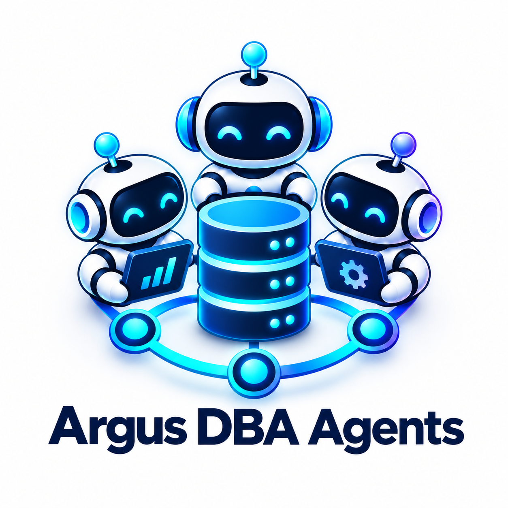

## Why It Exists

Operational AI is useful only when access, evidence, and accountability are visible. IRIS DBA Agents provides:

- A shared web workspace for DBAs and operators.
- Agent configuration in natural language without executable task text.
- A centrally controlled catalog of IRIS SysAdmin operations.
- Manual and interval-based execution.
- Reports backed by persisted tool-call evidence.
- Local inference with Ollama or an OpenAI deployment.
- IRIS-native authentication, authorization, and persistence.

This repository currently delivers an MVP. It is not a general-purpose autonomous operations platform, a notification service, or a complete observability suite.

The current MVP implements the agent editor, shared tool governance, manual and interval-based execution, IRIS persistence, report inspection, and per-call evidence. The broader `AI_*` schema contains foundations for future alerting, proposals, routines, memory, and richer workflows; those foundation tables should not be confused with active MVP features. Today, an agent can still invoke approved SysAdmin task operations and other mutating endpoints, as demonstrated below, but deterministic alert delivery is not yet a standalone subsystem.

## Current Capabilities

- Create, edit, enable, and pause shared DBA agents.
- Define agent instructions and one natural-language task.
- Select between 1 and 12 enabled SysAdmin operations per agent.
- Pin fixed operation parameters that the model cannot override.
- Run agents on demand or every 60 to 86,400 seconds.
- Review queued, running, successful, partial, failed, and cancelled runs.
- Inspect the final report, configuration snapshot, tool arguments, results, outcomes, and evidence IDs.
- Search the 276-operation pinned SysAdmin contract.
- Enable or block individual supported operations.
- Restore the 18 reviewed read-only operations or block the entire catalog.
- Use Ollama locally or OpenAI through deployment configuration.

Enabling an operation is standing authorization for assigned agents to invoke it automatically, including during scheduled runs. There is no approval prompt for each call. A DBA must review mutating operations before enabling them.

## Product Tour

The screenshots below come from the running application. They show the current implementation rather than design mockups.

### Registered agents

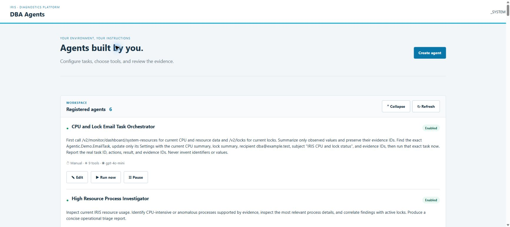

The main workspace lists every shared DBA agent, its current enabled or paused state, task, model, schedule, and number of assigned tools. A designer can edit an agent, an operator can run it immediately, and authorized users can pause or enable it. The **Runs and reports** area records recent executions and distinguishes succeeded, partial, failed, running, and queued states.

Use this area to:

1. Review the administrative agents already available to the team.
2. Select **Run now** for an on-demand investigation.
3. Select **Edit** to change an agent's instructions, task, cadence, or approved operations.
4. Open **View report** after completion to inspect the report and its evidence.

### Create or edit an agent

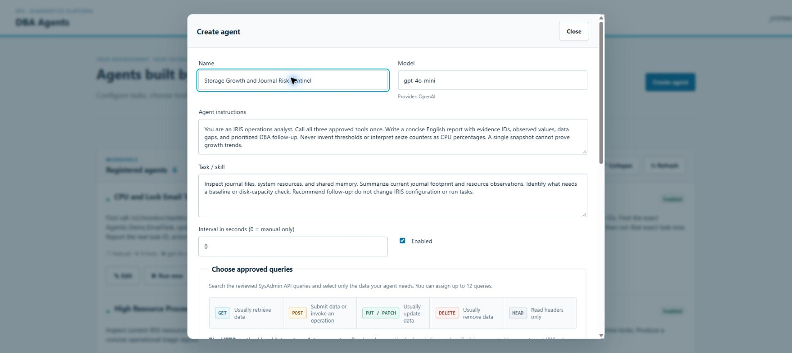

The editor turns an operational idea into a reusable agent. The example above defines a **Storage Growth and Journal Risk Sentinel**, saved and executed in the walkthrough below. It is manual-only (`0`) for the demonstration; use `3600` to schedule an hourly check after reviewing its behavior and provider costs. The fields have distinct responsibilities:

- **Name** identifies the operational capability for other administrators.
- **Model** shows the deployment-selected model used for reasoning.
- **Agent instructions** define the agent's role, evidence discipline, boundaries, and reporting style.
- **Task / skill** states the concrete outcome for each run.
- **Interval** is `0` for manual-only execution or 60–86,400 seconds for scheduled execution.
- **Enabled** controls whether the agent may be run or scheduled.

The same form is used to edit an existing agent. Saving creates or updates the registration in `Agentic.MVP_AGENT`; every run later receives an immutable copy of that configuration.

### Choose approved queries

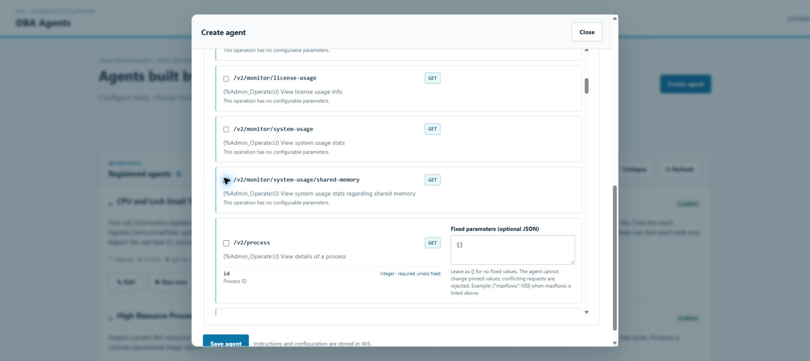

**Choose approved queries** is the per-agent tool allowlist. These operations are generated from the pinned [`specification/mainspec_v2.json`](specification/mainspec_v2.json) contract. They are the exact SysAdmin API operations through which the agent communicates with the target IRIS instance—such as reading system resources, listing locks, inspecting processes, creating or updating an IRIS task, or running that task.

Only operations that the DBA has enabled in the shared catalog appear here. The designer may assign up to 12 operations and may pin fixed JSON parameters. A pinned value cannot be replaced by the model: if an agent is assigned `GET /v2/locks` with `{"maxRows":100}`, a conflicting model request is rejected before any network call.

The HTTP method is an important operational signal:

- `GET` and `HEAD` usually inspect IRIS state.
- `POST` can create or invoke an operation.
- `PUT` and `PATCH` usually update configuration.
- `DELETE` usually removes state.

The method alone is not a safety classification. The DBA should read the operation description, confirm the required IRIS privilege, and verify support in the target IRIS release.

### Tool availability and SysAdmin catalog

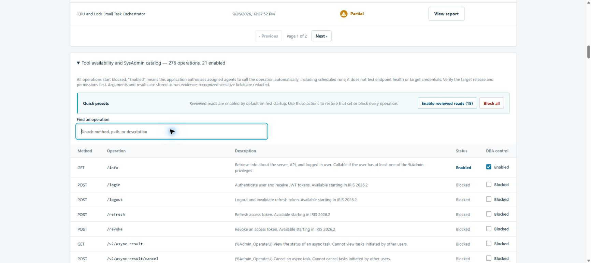

The shared catalog is the administrative control plane. It imports 276 operations from the pinned SysAdmin specification and starts with all operations blocked. On a new deployment, a reviewed preset enables 18 read-only operations; a DBA approver can restore that preset, block the complete catalog, search the specification, or enable individual operations. The screenshot reflects a configured demonstration environment, so its enabled count can be higher than the default preset.

Catalog availability and agent assignment are separate gates: an operation must be enabled globally **and** assigned to the specific agent. Immediately before dispatch, the gateway checks both gates again, verifies the pinned contract hash and arguments, applies fixed parameters, and uses the configured server-side IRIS identity. Enabling a mutating or sensitive operation requires explicit acknowledgment in the UI.

This is what makes the portal extensible. A DBA is free to build agents that only observe, agents that raise operational findings, or tightly scoped agents that create and run IRIS tasks in response to identified conditions. The administrator chooses the capabilities; IRIS roles and the portal policy determine what can actually execute.

### Runs and reports — inspect activity before opening details

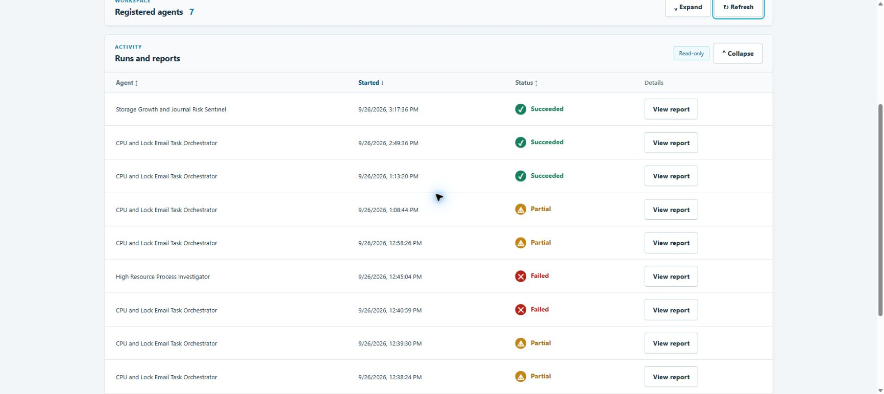

This is the execution overview, **before opening any report popup**. The first row is the newly saved **Storage Growth and Journal Risk Sentinel**, which completed successfully. Earlier runs remain visible with **Succeeded**, **Partial**, and **Failed** outcomes, making incomplete investigations visible instead of hiding them behind a report.

1. In **Registered agents**, select **Run now** on an enabled agent.
2. Follow its row in **Runs and reports**. **Queued** means it awaits the worker; **Running** means execution is in progress. Use **Refresh** to reload activity.
3. Review the final status: **Succeeded** means the runtime completed with successful tool evidence and no recorded tool failure; **Partial** means the run needs investigation, such as a failed tool call despite other useful evidence. Neither status certifies that every model conclusion is correct.
4. Sort by agent, start time, or status, and use pagination for older runs. Only then select **View report** to examine instructions, conclusions, and individual calls.

### Practical example — save, run, and audit the sentinel

This example was actually saved to IRIS and run from the frontend on **September 26, 2026, at 3:17:36 PM** (browser-local time), not left as an unsaved form. Revision **1** finished **Succeeded**, with all three assigned tools recording **SUCCEEDED**.

To reproduce it, fill the editor as shown above, leave **Enabled** checked, set the interval to `0`, and select these three approved operations:

| Approved operation | Purpose | Fixed parameters |
| --- | --- | --- |
| `GET /v2/journal/files` | Inventory journal files and their reported sizes | `{"maxRows":100}` |
| `GET /v2/monitor/dashboard/system-resources` | Inspect current resource counters | None |
| `GET /v2/monitor/system-usage/shared-memory` | Inspect shared-memory allocation and usage | None |

Select **Save agent**, locate the saved registration, and select **Run now**. The task requests a current snapshot, evidence IDs, data gaps, and DBA follow-up. It explicitly prohibits configuration changes and task execution. The name describes the monitoring objective; a single run cannot establish a growth trend or prove that disk capacity is sufficient.

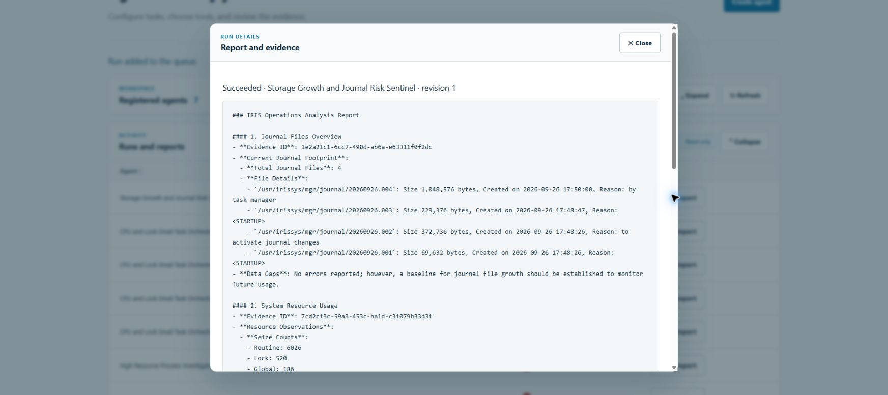

In this execution, the journal evidence returned **four files** with `Size` values of **1,048,576**, **229,376**, **372,736**, and **69,632 bytes**. The report also summarized resource and shared-memory observations and recommended establishing a baseline for later comparison. These are demonstration-instance observations, not expected values for another installation. A zero-valued memory category alone is not proof of an incident; the DBA must assess the returned fields and workload context.

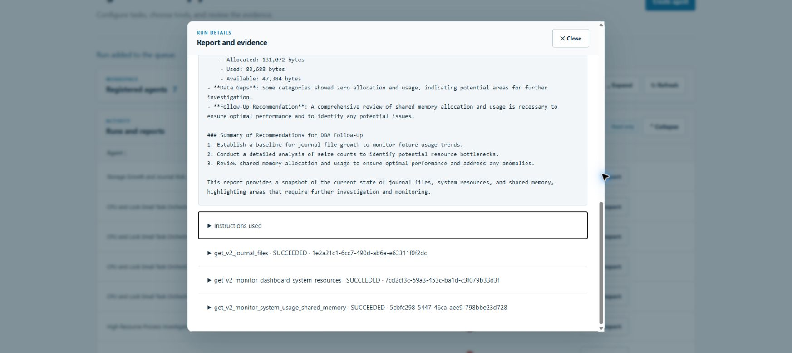

The recorded audit path is:

| Order | Tool | Evidence ID |
| --- | --- | --- |
| 1 | `get_v2_journal_files` | `1e2a21c1-6cc7-490d-ab6a-e63311f0f2dc` |
| 2 | `get_v2_monitor_dashboard_system_resources` | `7cd2cf3c-59a3-453c-ba1d-c3f079b33d3f` |
| 3 | `get_v2_monitor_system_usage_shared_memory` | `5cbfc298-5447-46ca-aee9-798bbe23d728` |

The practical value is a repeatable DBA inspection with a traceable source for each observation. After validating it, an administrator can schedule repeated checks or design a separate incident-response agent with explicitly approved task operations. This example itself does not send notifications, mutate IRIS settings, or implement historical trend detection.

### Report and evidence

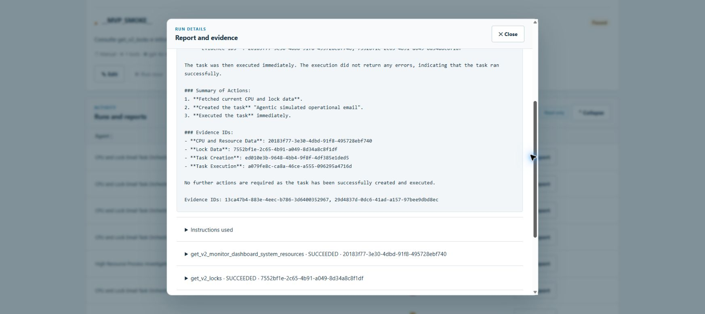

The report drawer is the most important audit surface. It shows the model's final report and, directly beneath it, the ordered path of tools that the agent actually executed. Each row records the tool name, outcome, and immutable evidence ID. In the demonstrated run, the agent:

1. Read current system-resource data.
2. Read the current lock table.
3. Looked for the target IRIS task.
4. Submitted a task-creation request.
5. Queried the task list again.
6. Submitted an immediate task-run request.

Those calls prove which operations were invoked, not that the model selected the intended task correctly. In this older demonstration, the report described task ID `1` as assumed. A production workflow must obtain and verify the exact identifier from returned evidence before taking action; a green run status is not a substitute for that check.

This sequence is not inferred from prose: it is reconstructed from persisted `Agentic.MVP_CALL` rows. A run cannot be marked successful without at least one successful tool call, and the runtime appends missing evidence IDs to the final report.

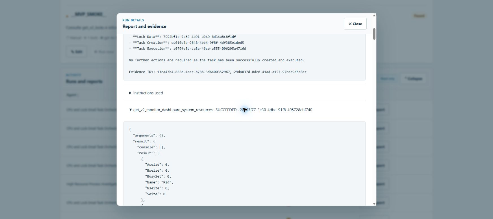

Expand any tool row to inspect its validated arguments and the result returned by IRIS. This lets a DBA verify which observation supported a claim, which identifier was used for an action, and whether the call succeeded or failed. Recognized password-, secret-, token-, credential-, authorization-, and API-key-like fields are redacted before evidence is persisted.

### SQL verification of agent activity

The application stores its active runtime state in the `Agentic` SQL schema, so the UI audit trail can also be independently verified with standard IRIS SQL.

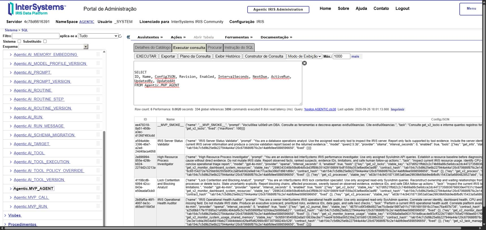

The registered-agent query confirms that configuration, revision, enabled state, cadence, assigned tools, and update identity are persisted in IRIS.

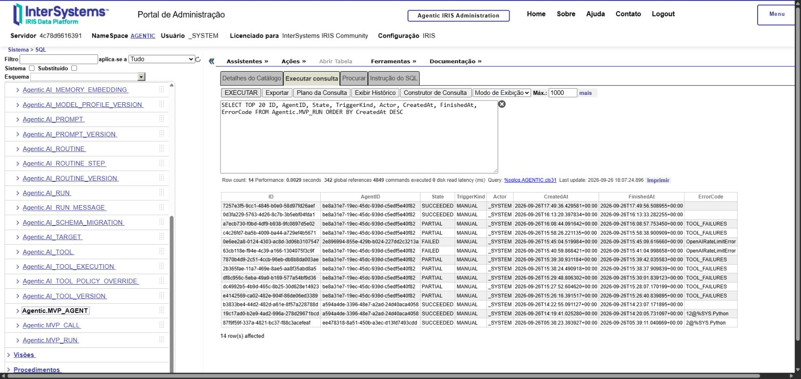

The run query exposes immutable execution snapshots and final states, including partial and failed outcomes rather than hiding them.

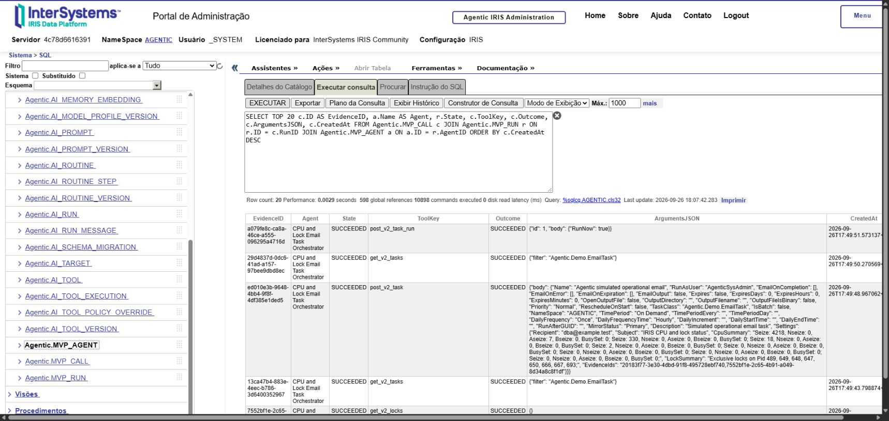

The joined evidence query shows the real administrative path: evidence ID, agent, run state, tool key, call outcome, validated arguments, and timestamp. In the demonstration, the SQL rows prove that the agent read resources and locks, searched for a task, created it, and invoked it with `RunNow`.

## System Architecture

```text
                                      model request / tool decision
                              +--------------------------------------+
                              |                                      v
+---------+   HTTPS/HTTP   +--+-------------------+           +--------------+
| Browser |--------------->| IRIS WSGI application|           | Ollama or    |
|         |<---------------| Flask + static UI    |           | OpenAI       |
+---------+                 +----------+-----------+           +------+-------+
                                       | SQL                           |
                                       v                               |
                            +----------+-----------+                   |
                            | InterSystems IRIS    |                   |
                            | configuration, queue,|                   |
                            | runs, and evidence   |                   |
                            +----------+-----------+                   |
                                       ^                               |
                                       | claim / update                |
                            +----------+-----------+                   |
                            | Embedded Python     |<------------------+
                            | worker + scheduler  |
                            +----------+----------+
                                       |
                                       | validated server-side request
                                       v
                            +----------------------+
                            | IRIS SysAdmin API    |
                            | fixed target gateway |
                            +----------------------+
```

### Components

| Component | Implementation | Responsibility |
| --- | --- | --- |
| Web application | Flask running as an IRIS WSGI application | Serves the UI and authenticated API under `/agentic` |
| Web client | HTML, CSS, and browser JavaScript | Manages agents, catalog availability, runs, and report inspection |
| Database | InterSystems IRIS namespace `AGENTIC` | Stores migrations, tools, agents, runs, calls, reports, and policy history |
| Worker | Embedded Python process inside the IRIS container | Schedules runs, claims the queue, invokes the model, and persists results |
| Model adapter | LangChain with Ollama or OpenAI | Produces tool calls and the final English report |
| SysAdmin gateway | Server-side Python HTTP client | Enforces tool assignment, contract version, availability, schema, size, timeout, and target rules |
| Supervisor | Python process inside the IRIS container | Restarts the worker with a bounded retry policy and maintains readiness state |

The browser never receives model-provider secrets or SysAdmin gateway credentials.

## Execution Flow

1. A designer saves an agent configuration.
2. The application validates its model, interval, assigned tools, and fixed parameters.
3. A manual action or the scheduler creates an immutable run snapshot in `MVP_RUN`.
4. The single worker claims the oldest queued run.
5. The model receives the saved instructions, task, and only the assigned tool definitions.
6. Every requested call passes through the gateway.
7. The gateway confirms that the tool is assigned, still enabled, pinned to the current contract, and supplied with valid arguments.
8. The gateway calls the configured IRIS SysAdmin API without redirects and with bounded time and response size.
9. Arguments, redacted results, outcome, and evidence ID are stored in `MVP_CALL`.
10. The model produces a report. The runtime guarantees that recorded evidence IDs are included.
11. The run is finalized and the agent execution slot is released.

A run cannot succeed without at least one successful tool call.

## Technical Persistence Map

IRIS stores runtime data in the `Agentic` SQL schema within the `AGENTIC` namespace.

### Active MVP tables

| Table | What it stores | Important fields |
| --- | --- | --- |
| `Agentic.MVP_AGENT` | Current agent registration and scheduling state | `ID`, `Name`, `ConfigJSON`, `Revision`, `Enabled`, `IntervalSeconds`, `NextDue`, `ActiveRun`, `UpdatedBy`, `UpdatedAt` |
| `Agentic.MVP_RUN` | Execution queue, immutable agent snapshot, report, and final state | `ID`, `AgentID`, `SnapshotJSON`, `State`, `TriggerKind`, `Actor`, `CreatedAt`, `StartedEpoch`, `FinishedAt`, `Report`, `ErrorCode` |
| `Agentic.MVP_CALL` | Tool calls and evidence for each run | `ID`, `RunID`, `ToolKey`, `ArgumentsJSON`, `ResultJSON`, `Outcome`, `CreatedAt` |
| `Agentic.AI_TOOL` | Stable identity of each imported SysAdmin operation | `ID`, `StableKey`, `Source`, `CreatedAt` |
| `Agentic.AI_TOOL_VERSION` | Pinned contract version, method, path, schema metadata, classification, risk, and availability | `StableKey`, `ContractHash`, `Method`, `PathTemplate`, `ParametersJSON`, `Classification`, `Risk`, `Enabled` |
| `Agentic.AI_TOOL_POLICY_OVERRIDE` | Audit history for catalog availability decisions | `ToolVersionID`, `PrivilegesJSON`, `Reason`, `Reviewer`, `ApprovalReference`, `CreatedAt` |
| `Agentic.AI_SCHEMA_MIGRATION` | Applied migration versions and checksums | `Version`, `Checksum`, `AppliedAt`, `DeploymentIdentity`, `Outcome` |

### Where agents are registered

An agent created in the web application is stored in `Agentic.MVP_AGENT`.

- `ConfigJSON` contains the name, instructions, task, provider, model, enabled state, interval, and assigned tool bindings.
- Each tool binding records `key`, `stable_key`, `contract_hash`, and optional fixed parameters.
- `Revision` provides optimistic concurrency control for edits.
- `ActiveRun` prevents more than one pending or active run for the same agent.
- `NextDue` drives interval scheduling.

When a run is created, the complete agent record is copied into `Agentic.MVP_RUN.SnapshotJSON`. Editing the agent later does not change the configuration already attached to that run.

The broader `AI_*` schema contains foundation tables for future workflows, versioned agents, routines, findings, proposals, memory, and alerts. Those tables are not the active persistence path for the current MVP agent editor and worker unless explicitly listed above.

### Useful SQL inspection queries

Run these in the `AGENTIC` namespace with an authorized IRIS account:

```sql
-- Registered agents
SELECT ID, Name, Revision, Enabled, IntervalSeconds, ActiveRun, UpdatedAt
FROM Agentic.MVP_AGENT
ORDER BY Name;

-- Recent runs
SELECT TOP 20 ID, AgentID, State, TriggerKind, Actor, CreatedAt, FinishedAt, ErrorCode
FROM Agentic.MVP_RUN
ORDER BY CreatedAt DESC;

-- Evidence for one run
SELECT ID, ToolKey, Outcome, ArgumentsJSON, ResultJSON, CreatedAt
FROM Agentic.MVP_CALL
WHERE RunID = ?
ORDER BY CreatedAt, ID;

-- Enabled SysAdmin operations
SELECT StableKey, Method, PathTemplate, Classification, Risk, ContractHash
FROM Agentic.AI_TOOL_VERSION
WHERE Enabled = 1
ORDER BY PathTemplate, Method;

-- Auditable tool path across agents, runs, and evidence
SELECT TOP 20
    c.ID AS EvidenceID,
    a.Name AS Agent,
    r.State,
    c.ToolKey,
    c.Outcome,
    c.ArgumentsJSON,
    c.CreatedAt
FROM Agentic.MVP_CALL c
JOIN Agentic.MVP_RUN r ON r.ID = c.RunID
JOIN Agentic.MVP_AGENT a ON a.ID = r.AgentID
ORDER BY c.CreatedAt DESC;
```

## Security Model

The application uses the authenticated IRIS WSGI security context. Application permissions are derived from IRIS roles.

| IRIS role | Application capability |
| --- | --- |
| `AgenticViewer` | View agents, runs, reports, and the catalog |
| `AgenticOperator` | View and run enabled agents |
| `AgenticAgentDesigner` | View, create, edit, pause, enable, and run agents |
| `AgenticDBAApprover` | Enable or block operations in the shared catalog |
| `%All` | Mapped to application administrator capabilities |

Startup also provisions restricted service identities:

- `AgenticWorker` accesses the queue and MVP persistence tables.
- `AgenticSysAdmin` calls the local SysAdmin API with the `AgenticSysAdminReader` role.

Additional controls include same-origin CSRF tokens for writes, parameter validation against JSON Schema, fixed-parameter enforcement, availability rechecks immediately before dispatch, pinned contract hashes, response-size limits, disabled redirects, and evidence redaction for password-, secret-, token-, credential-, authorization-, and API-key-like fields.

## Requirements

- Docker Engine with the Docker Compose plugin, or Docker Desktop with Compose enabled.
- A source checkout of this repository.
- Network access during the first build and model download.
- Sufficient memory for InterSystems IRIS Community and the selected model.

The default model can run on CPU. Response time depends on available CPU, memory, and model size.

## Installation: Local Ollama

### 1. Create the environment file

From the repository root:

```powershell
Copy-Item .env.example .env
```

On macOS or Linux:

```sh
cp .env.example .env
```

### 2. Review the local configuration

The supplied defaults use:

```dotenv
COMPOSE_PROFILES=local-llm
AGENTIC_ENV=development
AGENTIC_IRIS_PORT=52774
AGENTIC_PROVIDER=ollama
AGENTIC_OLLAMA_URL=http://ollama:11434
AGENTIC_MODEL=qwen2.5:3b
AGENTIC_SYSADMIN_URL=http://127.0.0.1:52773/api/admin
AGENTIC_SYSADMIN_USER=
AGENTIC_SYSADMIN_PASSWORD=
```

Empty SysAdmin credentials instruct startup to use the generated local gateway identity.

### 3. Build and start the services

```sh
docker compose --profile local-llm up -d --build
```

Startup performs the following actions:

- Creates the `AGENTIC` database and namespace.
- Configures the `/agentic` IRIS WSGI application.
- Applies checksum-protected SQL migrations.
- Creates application roles and restricted service identities.
- Imports the pinned 276-operation SysAdmin contract.
- Enables the reviewed read-only preset once on a new data volume.
- Starts the supervised worker.

### 4. Download the configured model

```sh
docker compose exec ollama ollama pull qwen2.5:3b
```

Use the exact value of `AGENTIC_MODEL` if you selected another model.

### 5. Verify readiness

```sh
docker compose ps
docker compose logs --tail=100 iris
```

Wait until both services report `healthy`.

### 6. Open the application

Open [http://localhost:52774/agentic/](http://localhost:52774/agentic/).

For a fresh local IRIS Community container, the development account is commonly `_SYSTEM` with password `SYS`. This account has full administrative access. Use it only on a local development deployment, change default credentials for persistent environments, and never expose this configuration directly to an untrusted network.

## Installation: OpenAI

Update `.env`:

```dotenv
AGENTIC_PROVIDER=openai
AGENTIC_MODEL=gpt-4o-mini
AGENTIC_OPENAI_API_KEY=replace-with-your-key
# AGENTIC_OPENAI_BASE_URL=https://optional-compatible-endpoint/v1
```

Remove or comment out `COMPOSE_PROFILES=local-llm` if Ollama is not required, then rebuild the IRIS service:

```sh
docker compose up -d --build iris
```

Provider settings are deployment-wide. Existing agents whose saved provider differs from the active deployment use the configured default model.

## Configuration Reference

| Variable | Default | Purpose |
| --- | --- | --- |
| `COMPOSE_PROFILES` | `local-llm` | Starts the bundled Ollama service |
| `AGENTIC_ENV` | `development` | Deployment environment label |
| `AGENTIC_IRIS_PORT` | `52774` | Local host port for the IRIS web application |
| `AGENTIC_PROVIDER` | `ollama` | Active provider: `ollama` or `openai` |
| `AGENTIC_MODEL` | `qwen2.5:3b` | Default model identifier for the active provider |
| `AGENTIC_OLLAMA_URL` | `http://ollama:11434` | Ollama endpoint visible from the IRIS container |
| `AGENTIC_OPENAI_API_KEY` | empty | OpenAI credential; keep it only in local environment configuration |
| `AGENTIC_OPENAI_BASE_URL` | empty | Optional OpenAI-compatible base URL |
| `AGENTIC_SYSADMIN_URL` | `http://127.0.0.1:52773/api/admin` | Fixed server-side SysAdmin API target |
| `AGENTIC_SYSADMIN_USER` | empty | Username for an external SysAdmin target |
| `AGENTIC_SYSADMIN_PASSWORD` | empty | Password for an external SysAdmin target |

For an external SysAdmin target, configure both credentials and grant only the privileges required by the enabled operations. Enabling an operation in the catalog does not grant privileges to the target identity.

## First Agent

1. Sign in with a user that has `AgenticAgentDesigner` or `%All`.
2. Select **Create agent**.
3. Enter a name, model, English instructions, and an English task.
4. Select one or more enabled tools.
5. Optionally add fixed parameters as JSON, for example `{"maxRows": 100}`.
6. Keep the interval at `0` for manual execution or select an interval from 60 to 86,400 seconds.
7. Save the agent and select **Run now**.
8. Open **View report** after the run finishes.
9. Compare every important report claim with the displayed tool evidence.

Example instructions:

```text
You are a database operations analyst. Use only the assigned read-only tools.
Report facts supported by tool evidence, identify limitations, and keep the response concise.
```

Example task:

```text
Inspect the current IRIS server information and produce a concise validation report.
```

## Operational Limits

- One worker executes runs per deployment.
- One run may be pending or active per agent.
- Run timeout: 240 seconds.
- Model iteration limit: 8.
- Tool-call limit: 12 per run.
- Tool assignment limit: 12 per agent.
- GET responses with `maxRows` are restricted to 1 through 500.
- Model-facing repeated list data is sampled to a maximum of 8 rows; persisted evidence remains bounded separately.
- Runs interrupted by worker restart are marked failed and are not replayed.
- Scheduled task conditions are interpreted by the model, not enforced as deterministic alert rules.

Model-generated summaries may still contain mistakes. Evidence is the authoritative record.

## Stop, Restart, and Data Retention

Stop containers while preserving IRIS data and downloaded models:

```sh
docker compose down
```

Restart the local deployment:

```sh
docker compose --profile local-llm up -d
```

The `agentic-data` and `ollama-models` volumes are persistent. Do not run `docker compose down -v` unless permanent deletion of agents, runs, evidence, configuration, and downloaded models is intended.

## Development and Validation

Run the complete lint, formatting, and test pipeline through the test image:

```sh
docker build --target test -t agentic-iris-tests .
```

The build validates the reviewed read-only manifest against the pinned contract and runs the Python test suite without requiring a host Python installation.

Runtime smoke and acceptance scripts are available under `scripts/`. They require a running deployment and the credentials documented by each script.

## Repository Map

```text
app/
  api/                 Session, health, and foundation API routes
  mvp/                 Agent validation, catalog, runtime, gateway, and repository
  repositories/        IRIS SQL access
frontend/              Web UI templates and static assets
worker/                 Scheduler, runner, and supervisor
migrations/            IRIS SQL schema migrations
specification/         Pinned SysAdmin contract and reviewed-read manifest
scripts/               Startup, readiness, smoke, and acceptance checks
tests/                 Unit and API tests
```

## Project References

- [Development plan](DEVELOPMENT_PLAN.md)
- [MVP implementation plan](docs/MVP_PLANO.md)
- [MVP validation notes](docs/MVP_VALIDACAO.md)
- [Compatibility notes](docs/compatibility.md)
- [Pinned SysAdmin contract](specification/mainspec_v2.json)
- [Reviewed read-only operations](specification/reviewed_read_operations.json)