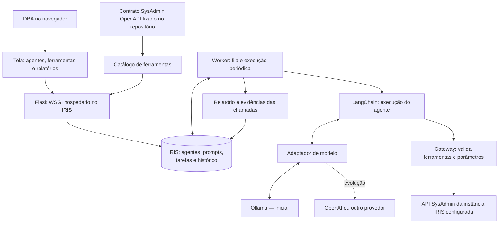

# MVP — Plataforma de agentes DBA

## 1. MISSÃO

Entregar uma plataforma em que o DBA cria agentes, escreve suas instruções e tarefas, escolhe as ferramentas permitidas e acompanha execuções e relatórios.

Não cadastrar agentes automaticamente. O exemplo de monitorar 50 locks é uma configuração feita pelo DBA, não uma regra fixa da aplicação.

## 2. MAPA DE CONTEXTO

O arquivo OpenAPI descreve as ferramentas; as chamadas são feitas à API SysAdmin da instância configurada, não ao GitHub. O catálogo usa uma versão fixada do [contrato oficial](https://github.com/intersystems-community/sysadmin-api-specification/blob/master/mainspec_v2.json).

## 3. REGRAS DA OPERAÇÃO

- DBA define nome, instruções, tarefas, ferramentas e frequência de cada agente.
- Skills, neste MVP, são instruções de tarefas com ferramentas autorizadas; não são código enviado pelo usuário.
- Prompts, configurações, execuções e relatórios ficam no banco IRIS.
- LangChain interpreta a tarefa e solicita ferramentas conforme necessário.
- O gateway verifica cada chamada. O modelo não recebe credenciais nem acesso direto a SQL, shell ou URLs livres.
- MVP executa apenas ferramentas de leitura revisadas. Operações de alteração ficam bloqueadas.
- Ollama é o provedor inicial. Uma interface de modelo permite acrescentar OpenAI posteriormente.
- Execução manual ou periódica, com limite de tempo e chamadas. Pausar um agente impede novos agendamentos.
- Falhas aparecem no histórico; ausência de dados não deve virar diagnóstico de sucesso.

## 4. SITUAÇÃO ATUAL

Existe uma base Flask/WSGI autenticada no IRIS, catálogo inicial e worker de conectividade. O fluxo completo de criação e execução de agentes ainda será implementado. O Ollama anterior não foi encontrado no contexto Docker atual.

## 5. PLANO DE EXECUÇÃO

| Fase | Ordem | Critério de conclusão |
| --- | --- | --- |
| 1 — Cadastro | Criar persistência e APIs para agentes, prompts, tarefas e ferramentas selecionadas. Incluir edição, ativação e pausa. | DBA salva, consulta e edita um agente; dados sobrevivem à reinicialização. |
| 2 — Ferramentas | Resolver parâmetros do contrato, disponibilizar catálogo e gateway de leitura com alvo e credenciais configurados no servidor. | Ferramenta autorizada consulta o SysAdmin real; ferramenta não autorizada ou de alteração é recusada. |
| 3 — Inteligência | Integrar LangChain e Ollama por adaptador. Carregar instruções e ferramentas do agente salvo. | Agente criado pelo DBA escolhe e chama uma ferramenta permitida e produz relatório com evidências. |
| 4 — Execução | Implementar fila persistente, execução manual, intervalo configurável, limites e recuperação de falhas. | Execuções não se sobrepõem para o mesmo agente; pausa e reinicialização têm comportamento verificado. |
| 5 — Tela | Entregar lista e contagem de agentes, formulário de configuração, seleção de ferramentas e histórico detalhado. | DBA conclui o fluxo pelo navegador, sem editar arquivos ou banco. |
| 6 — Validação | Construir containers e testar fluxo real, permissões, indisponibilidade do modelo e persistência. | Build, testes e fluxo completo passam; limitações ficam registradas. |

Executar uma fase por vez. Validar antes de avançar. Não declarar conclusão com testes ou integração pendentes.

## 6. EXERCÍCIO DE ACEITAÇÃO

1. DBA abre a plataforma vazia e cria um agente.
2. Escreve: “Quando houver pelo menos 50 locks, inspecione os processos envolvidos e registre um relatório de erro.”
3. Seleciona as ferramentas de consulta de locks e detalhes de processos e configura o intervalo.
4. A plataforma salva o prompt e a configuração no IRIS.
5. O worker executa o agente com LangChain e Ollama usando somente as ferramentas selecionadas.
6. Em cenário controlado com 50 locks, o histórico registra consultas, processos observados e relatório. Abaixo do limiar, registra que a condição não ocorreu.
7. DBA pausa o agente e verifica que novos ciclos não são agendados.

Esse exercício testa a plataforma. Não cria um agente padrão nem garante detecção em tempo real: o monitoramento ocorre a cada intervalo configurado.

## 7. FORA DO MVP

Alterações administrativas automáticas, fluxo de aprovação de mudanças, múltiplas instâncias pela interface, memória vetorial, colaboração entre agentes e notificações externas.

## 8. ESTADO FINAL EXIGIDO

DBA cria e configura seus próprios agentes pela tela. Agentes executam tarefas de diagnóstico com ferramentas SysAdmin autorizadas. Instruções e resultados persistem no IRIS. Nenhum agente vem pré-cadastrado.
